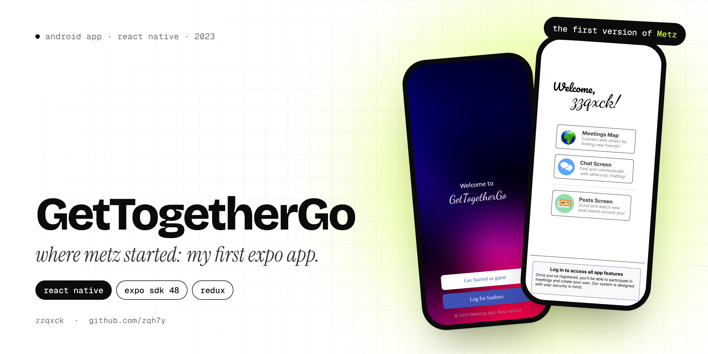
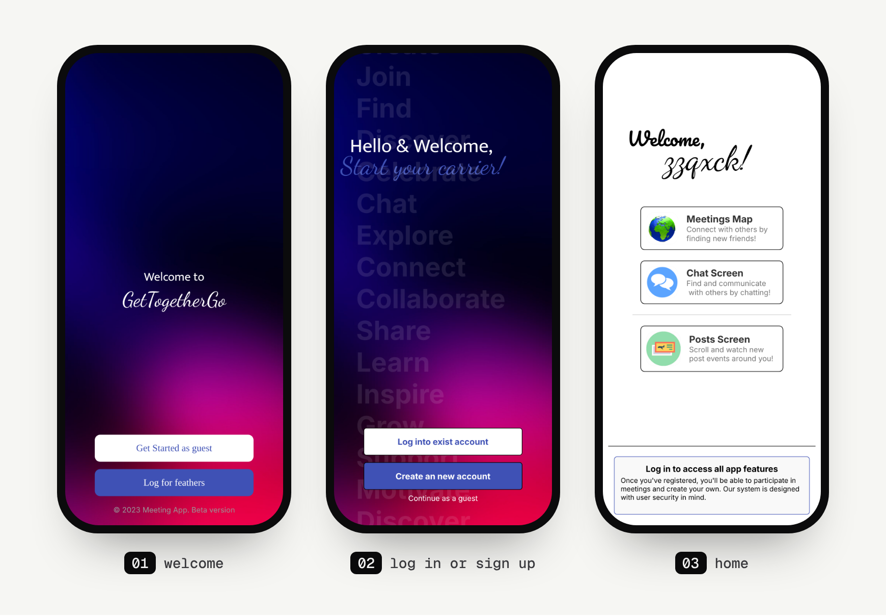

<p align="center">
  
</p>

<p align="center">
  
  
  
  
</p>

# GetTogetherGo

GetTogetherGo was my **first Expo app** (2023) and the first version of an idea I still haven't let go of: an app for finding people around you and meeting up with them. You'd see meetings on a map, join the ones you like, chat with people, join groups and post what's going on around you.

It never got published, but almost everything I've built since grew out of it. The same idea came back as MeetingsApp, then as [Metz](https://github.com/zqh7y/Metz) in 2024, and today it's **[Metz V2](https://github.com/zqh7y/MetzV2)**, which I'm still building.

> **Where's the code?** This branch only has the README. The full Expo project, with all the screens, images and fonts, is on the **[`main`](https://github.com/zqh7y/GetTogetherGo/tree/main)** branch.

## Screens

<p align="center">
  
</p>

## What's in it

- **Welcome and accounts.** A welcome screen, log in, sign up, or continue as a guest.
- **Home** with three ways in: the meetings map, the chat screen and the posts screen.
- **Meetings map** built on `react-native-maps`.
- **Create a meeting** with a title (30 characters), a description (500 characters) and a location, plus a set of rules: delete your meeting when it's over, and no fake meetings or you get banned.
- **Find a meeting** with search, a filter and recommended meetings you can join.
- **Social:** recommended groups to join, people to meet, creating your own group, and a profile with a photo.
- **Posts:** a feed of posts from around you.
- **Notes** for your own meetings.

Most of the content (groups, people, meetings) is sample data. There was no server yet, and accounts are stored on the phone with `expo-sqlite`.

## How it's built

| Part | Tech |
|---|---|
| Framework | React Native 0.71, Expo SDK 48 |
| State | Redux (`redux`, `react-redux`) |
| Maps | `react-native-maps` |
| Storage | `expo-sqlite`, AsyncStorage |
| Other | `expo-image-picker`, `@react-native-picker/picker`, `expo-font` (Pacifico, Dancing Script, Josefin Sans, Mukta) |

The screens live in `js/`, split into `Log/` (welcome, log in, sign up), `Meeting/` (map, create, find, notes) and `Social/` (home, chat, groups, profile, posts).

## Run it

```bash
git clone -b main https://github.com/zqh7y/GetTogetherGo.git
cd GetTogetherGo
npm install
npx expo start
```

It's a 2023 project on Expo SDK 48, so expect it to need some updating before it runs on a current Expo Go.

---

<p align="center">
  Made by <b>zzqxck</b> · <a href="https://zqh7y.github.io/Portfolio/">portfolio</a> · <a href="https://github.com/zqh7y">more projects</a>
</p>
